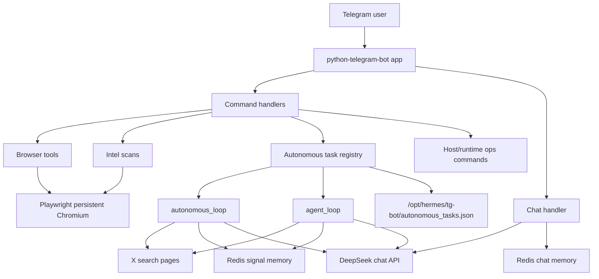
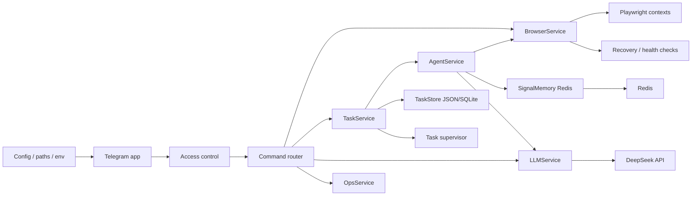

# Hermes Telegram Bot System Architecture

## Overview

This project is a single-file Telegram bot that combines chat, browser automation, crypto intelligence scans, autonomous monitoring loops, and persistent agent tasks.

The live runtime is implemented in `tg_bot.py`. State is split across:

- Redis for chat memory and signal deduplication.
- `autonomous_tasks.json` for restart-persistent background task definitions.
- Playwright persistent browser profiles under `/opt/hermes/browser-data`.
- Filesystem logs and screenshots under `/opt/hermes/logs` and `/opt/hermes/workspace/screenshots`.

At startup, the bot registers Telegram commands, schedules restoration of persisted autonomous tasks, and starts polling Telegram.



## 1. Browser Architecture

The browser layer is built on Playwright's async API with persistent Chromium contexts.

There are two browser models in the code:

- A default shared browser context:
  - Globals: `playwright_instance`, `browser_context`, `browser_page`, and `browser_lock`.
  - Created by `init_browser()`.
  - Uses `/opt/hermes/browser-data/default` as its persistent profile.
  - Used by most commands and by both active monitoring loops.

- A per-agent browser pool:
  - Globals: `browser_pool`.
  - Managed by `get_agent_page(agent_name)` and `reset_agent_browser(agent_name)`.
  - Intended to create isolated persistent profiles at `/opt/hermes/browser-data/{agent_name}`.
  - Currently not used by `agent_loop()`, which instead uses the default `browser_page`.

The default browser supports:

- `/open` and `/search` navigation.
- `/screenshot` full-page screenshots.
- `/read` page text extraction.
- `/askpage` LLM analysis of the current page.
- `/click`, `/clickindex`, `/type`, `/typeactive`, `/press`, `/scroll`, and `/extractlinks`.

Most browser command handlers call `init_browser()` directly and operate on the shared `browser_page`. `agent_loop()` wraps shared browser access with `browser_lock`, but `autonomous_loop()` and manual browser commands do not consistently acquire that lock. This means background jobs and user commands can race on the same tab.

## 2. Autonomous Loop

`autonomous_loop(chat_id, keyword)` is a five-minute polling loop for arbitrary X search keywords.

Each cycle:

1. Builds an X search URL from the keyword.
2. Opens the URL through `browser_open()`.
3. Waits for the page to load.
4. Scrolls once.
5. Extracts `body` text.
6. Filters previously seen blocks through signal memory.
7. Sends new text to DeepSeek for a crypto intelligence summary.
8. Sends the result back to the Telegram chat.
9. Sleeps for 300 seconds.

If no new signal blocks remain after deduplication, the loop skips LLM analysis for that cycle and sleeps.

On exceptions, the loop sends an error message to Telegram and continues after the sleep. It does not reset the default browser context.

## 3. Agent System

The agent system is a named profile layer over the autonomous loop idea.

`AGENT_PROFILES` defines specialized agents:

- `btc`: Bitcoin sentiment and macro narrative.
- `eth`: Ethereum ecosystem and DeFi sentiment.
- `sol`: Solana ecosystem intelligence.
- `scam`: Wallet drainers, phishing, rugs, and fake airdrops.
- `breaking`: Urgent crypto news.

`/agent name` starts `agent_loop(chat_id, name)`. The loop uses the profile's keyword, role, and focus to construct a specialized LLM prompt.

Each agent cycle:

1. Builds an X search URL from the profile keyword.
2. Acquires `browser_lock`.
3. Uses the default browser page.
4. Navigates, waits, scrolls three times, and extracts page text.
5. Releases the browser lock.
6. Deduplicates text using `filter_new_signals("agent:{name}", body)`.
7. Sends a role-specific analysis prompt to DeepSeek.
8. Posts the result to Telegram.
9. Sleeps for 300 seconds.

Although `get_agent_page()` suggests per-agent browser isolation, the current implementation does not call it. All agents serialize browser access through one shared browser tab.

## 4. Persistent Tasks

Task persistence is implemented with an in-memory registry plus a JSON file.

- Runtime registry: `autonomous_tasks = {}`.
- Persistence file: `/opt/hermes/tg-bot/autonomous_tasks.json`.
- Save function: `save_autonomous_tasks()`.
- Restore function: `restore_autonomous_tasks()`.

Keys use these formats:

- Arbitrary autonomous monitor: `{chat_id}:{keyword}`.
- Named agent monitor: `{chat_id}:agent:{name}`.

When `/autonomous` or `/agent` starts a loop, the code creates an `asyncio.Task`, stores it in `autonomous_tasks`, and writes a JSON entry.

When `/stopauto` or `/stopagent` stops a loop, the code cancels the task, removes it from the registry, and rewrites the JSON file.

On startup, `restore_autonomous_tasks()` reads the file and recreates each task. The checked-in/current task file contains three restored agents: `btc`, `scam`, and `breaking`.

Limitations:

- The persistence file stores desired tasks, not task health.
- No task metadata is stored, such as last run time, last error, last signal count, or consecutive failures.
- Cancelled task exceptions are not explicitly awaited.
- The file path is absolute and environment-specific.

## 5. Browser Recovery

Browser recovery exists, but it is narrow and partially disconnected from active browser use.

`reset_agent_browser(agent_name)`:

- Looks up an item in `browser_pool`.
- Closes its context if present.
- Removes the pool entry.
- Deletes Chromium singleton lock files from `/opt/hermes/browser-data/{agent_name}`.
- Logs that the agent browser was reset.

`agent_loop()` calls `reset_agent_browser(f"agent_{name}")` after an exception.

The issue is that `agent_loop()` does not use `get_agent_page(f"agent_{name}")`; it uses the default `browser_page`. Therefore, the reset usually targets a per-agent context that was never opened. If the shared default browser is broken, this recovery path does not repair it.

`autonomous_loop()` has no browser reset path at all.

Manual commands also report browser errors but do not reset the shared context.

## 6. Signal Memory

Signal memory is Redis-backed deduplication for extracted page content.

Core functions:

- `signal_hash(text)`: normalizes a text block and hashes it to a 16-character SHA-256 prefix.
- `filter_new_signals(keyword, text)`: splits text into non-empty paragraph blocks, ignores short blocks, stores unseen hashes in Redis, and returns only new blocks.

Redis keys use:

```text
signal_memory:{keyword}
```

Each signal memory key expires after seven days.

This design reduces repeated LLM calls and repeated Telegram alerts when X search pages contain the same visible content across polling cycles.

Important behaviors:

- Deduplication is textual, not semantic.
- The hash uses normalized full blocks, so small changes in a block can create a new signal.
- The returned body is capped to the first 20 new blocks.
- Signal memory is separated for arbitrary keywords and named agents.

## 7. Self Healing

Self healing currently means "continue the loop after failure" plus "attempt a browser reset in agent loops."

Existing healing behavior:

- All long-running loops catch exceptions and continue after sleeping.
- `agent_loop()` sends a Telegram error message when it fails.
- `agent_loop()` attempts `reset_agent_browser(f"agent_{name}")`.
- `restore_autonomous_tasks()` recreates persisted loops after process restart.
- Host commands allow manual `/restartbot` and `/restartruntime`.

What self healing does not yet cover:

- Shared default browser context recovery.
- Playwright process restart.
- DeepSeek/API retry, timeout, or circuit breaker.
- Redis outage fallback.
- Task health monitoring.
- Backoff after repeated failures.
- Lock cleanup for the default profile.
- Startup validation of required env vars, binaries, Redis, and browser executable path.

## 8. Risks

The highest-impact risks are:

- Shared mutable browser page: most browser operations use the same tab. Manual commands, `autonomous_loop()`, and agents can interfere with each other.
- Incomplete locking: `agent_loop()` uses `browser_lock`, but `autonomous_loop()` and most command handlers do not.
- Recovery mismatch: agent self-healing resets `browser_pool`, while active agents use the default browser context.
- Absolute infrastructure paths: `.env`, logs, screenshots, browser profiles, task file, and Chromium executable are hard-coded to `/opt/hermes` and `/root/.cache`.
- Shell command exposure: operational commands use `subprocess.getoutput()` and `subprocess.Popen(shell=True)`. Current commands are static, but this pattern should stay tightly controlled.
- No authentication/authorization layer: any Telegram user reaching the bot can potentially invoke runtime and browser commands unless access is restricted externally.
- Blocking LLM calls inside async handlers: `client.chat.completions.create()` is synchronous and can block the event loop.
- No structured task supervision: failed tasks continue only if their internal loop catches the error. A task that exits unexpectedly may remain stale or disappear silently.
- Weak observability: logs exist, but there are no structured metrics, task heartbeats, failure counters, or browser health checks.
- Fragile X scraping: the system depends on visible X page text, DOM behavior, login/session state, and search result layout.
- No tests: browser, persistence, signal memory, and command routing behavior are untested.
- Single large module: unrelated concerns are coupled, making small changes riskier.

## 9. Refactor Opportunities

Recommended refactor path:

1. Split `tg_bot.py` by responsibility:
   - `config.py`: env vars, paths, constants.
   - `llm.py`: DeepSeek client and prompt helpers.
   - `browser.py`: browser lifecycle, page operations, recovery.
   - `signals.py`: signal memory and deduplication.
   - `tasks.py`: task registry, persistence, supervision.
   - `agents.py`: profiles and agent loop logic.
   - `commands.py`: Telegram command handlers.
   - `main.py`: app construction and startup.

2. Choose one browser concurrency model:
   - Shared browser with a mandatory lock for every operation.
   - Or per-agent/page isolation using `get_agent_page()` consistently.

3. Implement real browser recovery:
   - `reset_default_browser()`.
   - Health checks before each navigation.
   - Recreate Playwright and Chromium context on fatal browser errors.
   - Clear singleton locks for the default profile.

4. Add task supervision:
   - Store task metadata.
   - Track status, last run, last error, failure count, and next run.
   - Restart crashed tasks.
   - Expose `/taskstatus` or improve `/autolist`.

5. Make persistence environment-independent:
   - Base all paths on a configurable `HERMES_HOME`.
   - Write state atomically through a temp file and rename.
   - Validate file schema on restore.

6. Move synchronous API calls off the event loop:
   - Use an async OpenAI-compatible client if available.
   - Or wrap blocking calls with `asyncio.to_thread()`.

7. Add access control:
   - Allowlist Telegram user IDs or chat IDs.
   - Restrict runtime commands to admin users.

8. Add tests around pure logic:
   - Signal hashing and deduplication.
   - Task key serialization.
   - Restore/save behavior with temp files.
   - Prompt construction.
   - URL construction.

9. Improve observability:
   - Structured log events per task cycle.
   - Task heartbeat metrics.
   - Browser reset counters.
   - LLM latency and error counters.

## Target Architecture



The main design goal should be to separate lifecycle-heavy infrastructure from Telegram handlers. Command handlers should parse input, call services, and return messages. Browser, LLM, persistence, memory, and task supervision should each own their own failure behavior.

## Current-State Summary

Hermes is already useful as an operational crypto-intelligence bot: it can browse, scan X searches, summarize signals, run named monitoring agents, remember seen signals, and restore task intent after restart.

The architecture is currently closer to a powerful prototype than a robust service. The biggest next step is not adding more commands; it is making browser ownership, task supervision, and recovery explicit. Once those seams are clean, the existing autonomous and agent features become much easier to trust and extend.
